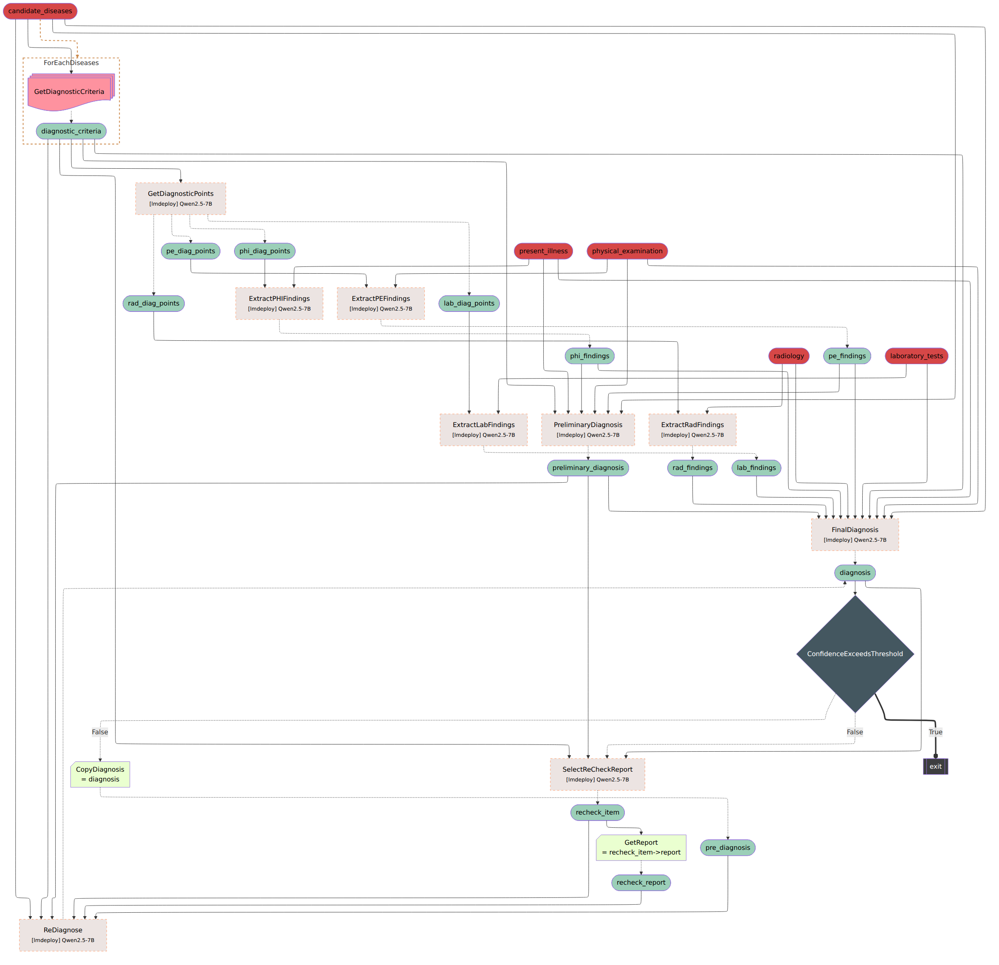

# Med-FoT

Based on the **SigmaFlow** framework, we propose a clinically diagnostic workflow for **15 abdominal diseases**, enabling LLMs to achieve accurate and efficient medical reasoning in complex diagnostic scenarios. By using the intermediate process data in the workflow, we constructed **high-quality long-form CoT** data and developed a new model, **Med-FoT**, which is capable of performing complex reasoning tasks. We evaluated the performance of Med-FoT on 15 abdominal diseases diagnostic tasks, demonstrating its superior performance compared to existing methods. Double-blind evaluation by two board-certified physicians confirms that its FoT rationales faithfully mirror authentic clinical reasoning. Details can be found in this [repo](https://github.com/maokangkun/Med-FoT).

### Pipeline

