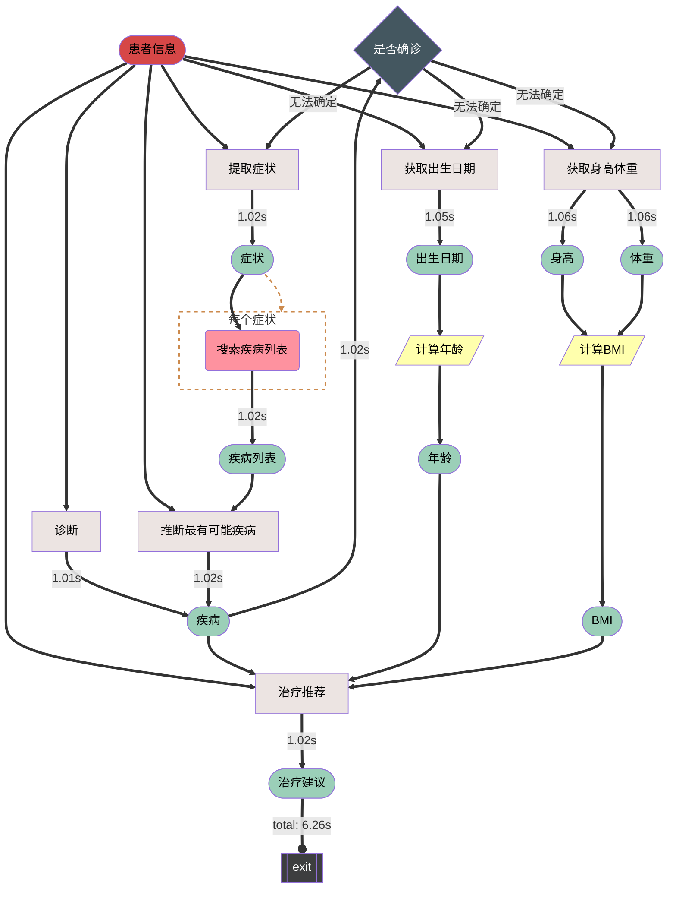

### Demo

Running example:
```bash
sigmaflow -p example/demo_pipeline.py -i example/demo_data.json -m async
```

or using python:
```bash
python example/demo.py
```

demo pipeline flow diagram:


demo pipeline performance:

```mermaid
gantt
title Task Timeline
dateFormat  x
axisFormat  %M:%S.%L
section coroutine
诊断: 0, 1021ms
是否确诊: 13, 2033ms
提取症状: 2047, 1026ms
获取出生日期: 2057, 1062ms
计算年龄: 2080, 1045ms
获取身高体重: 2067, 1072ms
计算BMI: 2083, 1059ms
搜索疾病列表: 3073, 1017ms
搜索疾病列表: 3078, 1020ms
搜索疾病列表: 3084, 1023ms
搜索疾病列表: 3089, 1027ms
搜索疾病列表: 3095, 1030ms
搜索疾病列表: 3100, 1033ms
搜索疾病列表: 3106, 1037ms
每个症状: 2077, 2068ms
治疗推荐: -3, 4168ms
推断最有可能疾病: 2086, 3082ms
是否确诊: 2089, 4103ms
exit: 10, 6242ms
```
