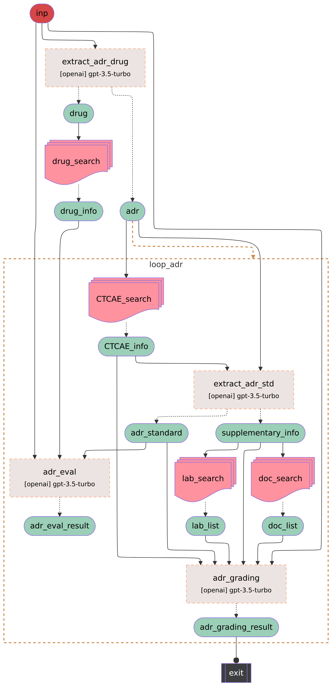

# Adverse Drug Reactions

A compact SigmaFlow example demonstrating how to extract adverse drug reactions (ADRs) and suspected drugs from clinical text, ground findings using CTCAE and drug knowledge bases, retrieve supporting documents and lab evidence, and use LLMs to evaluate causality and assign CTCAE grading.

## Features

- Extract ADR mentions and suspected drugs from clinical notes.
- Ground findings via RAG (CTCAE, drug KB, documents, labs).
- Evaluate ADRs and assign CTCAE grades using LLM prompts.
- Modular loop-based pipeline for processing multiple ADRs.

## Quick start

```bash
cd examples/adverse_drug_reactions
export DRUG_KB_ID=...
export CTCAE_KB_ID=...
export DOC_KB_ID=...
export LAB_KB_ID=...
sigmaflow -p adr_pipeline.py -i <input.json>
```

## Notes

- Prompts are available in `prompts/`.
- See `adr_pipeline.py` for defaults (LLM: `gpt-3.5-turbo`, RAG params).

### Pipeline


