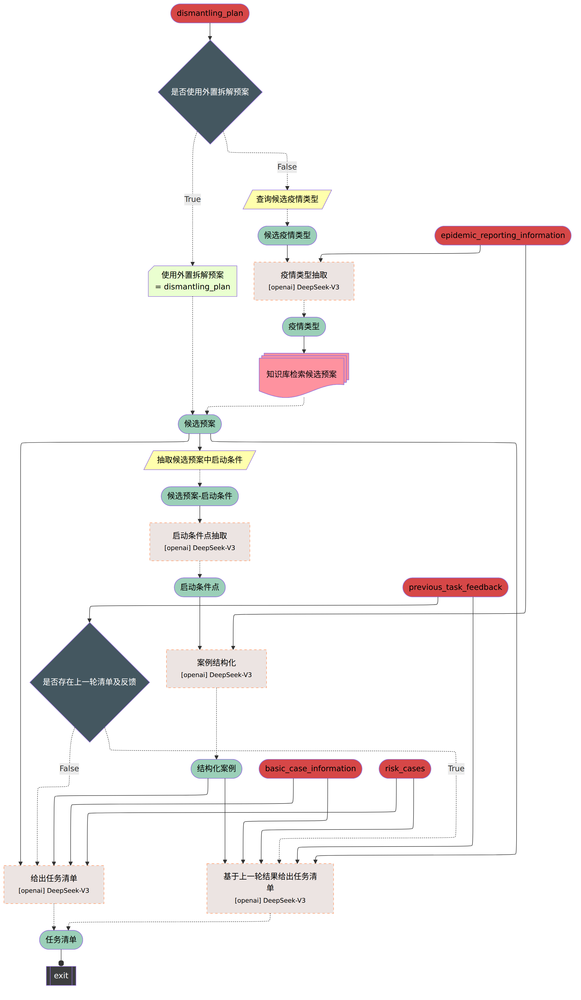

# EpiPlanAgent

Epidemic response planning is essential yet traditionally reliant on labor-intensive manual methods. This study aimed to design and evaluate **EpiPlanAgent**, an agent-based system using large language models (LLMs) to automate the generation and validation of digital emergency response plans. The multi-agent framework integrated task decomposition, knowledge grounding, and simulation modules. Public health professionals tested the system using real-world outbreak scenarios in a controlled evaluation. Results demonstrated that EpiPlanAgent significantly improved the completeness and guideline alignment of plans while drastically reducing development time compared to manual workflows. Expert evaluation confirmed high consistency between AI-generated and human-authored content. User feedback indicated strong perceived utility. In conclusion, EpiPlanAgent provides an effective, scalable solution for intelligent epidemic response planning, demonstrating the potential of agentic AI to transform public health preparedness.

### Pipeline

