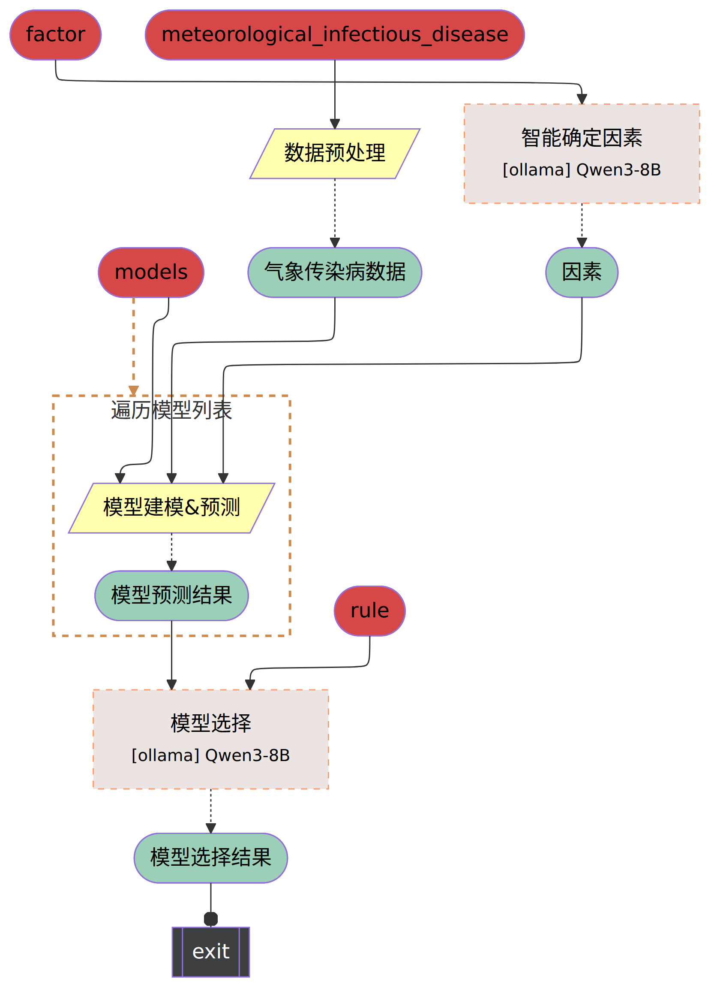

# Meteorological Infectious Disease

Demonstrates how to combine **meteorological data** and **infectious disease surveillance data** to build models and make predictions (the example uses influenza visit percentage as the prediction target). This example includes data preprocessing, LLM-assisted feature selection, training and prediction with multiple statistical/machine learning models (GAM, DLNM, RF, XGBoost, Serfling), and a model selection step based on model performance.

✅ **Highlights**

- **LLM-driven feature selection**: Use an LLM to select important meteorological features from candidate variables based on literature and official guidelines.
- **Multi-model comparison**: Several model implementations are provided under `models/`, returning common evaluation metrics (R2, RMSE, MAE, MAPE).
- **Modular pipeline**: Clear preprocessing, modeling, and model-selection nodes for easy extension and tuning.

### Pipeline

